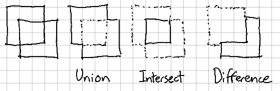
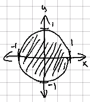
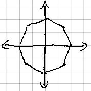
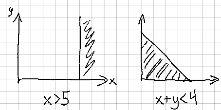
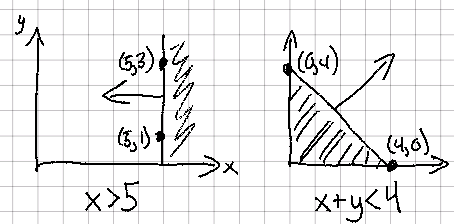
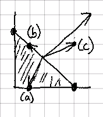
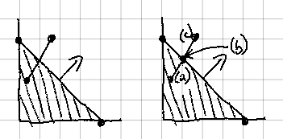

# Understanding Constructive Solid Geometry

> **Note:** this guide is a work in progress.
>
> Some diagrams are confusing. Some sections (in particular, everything three-dimensional)
> dearly need visualizations that we cannot currently generate. Not all sections have been written yet.

Constructive Solid Geometry, or CSG, is a powerful and useful tool at the
heart of modern solid modeling. A concise lay-definition of CSG could
be "math with shapes and solids." Despite this simple description, there are
a multitude of applications:

- Computer-aided design (CAD) can use CSG to help engineers and designers describe
  and compose complex objects and assemblies.
- Computer-aided manufacturing (CAM) often uses CSG to approximate the
  finished results and calculate important properties of the process like
  chip load and deposited material.
- Games sometimes use CSG for effects, or other physical calculations.

So, now that we have some idea what CSG might be useful for, let's review how
it works. There are three core CSG operations:

- _Union_: combining two objects.
- _Intersection_: finding where two objects overlap.
- _Removal_: deleting all parts of one object that appear in another.

|  |
|:--:|
| _Two squares and the resulting union, intersection, and removal_ |

This guide will take us through the guts of how these operations actually
work. It draws heavily on the theoretical framework sketched out by the
Computational Geometry Algorithms Library [in their
documentation](https://doc.cgal.org/latest/Nef_3/index.html). We will also
attempt to augment this framework by clarifying some concepts with additional
detail.

We'll address philosophical questions like "what is a solid?" and "what is a
shape?" while also describing how to model them and, eventually, how to do
"math" with them.

We start with two dimensions, because it is easier to visualize. However, in
the final sections we will see how it is easy to extend the core concepts we
describe to the third dimension.

### What are Things?

We formally define shapes and solids as "containers of points." Specifically,
for our analysis, we consider such containers as dividing points into three
categories:

- Things that are _in_ the container.
- Things that are _on_ the container.
- Things that are _out_ of the container.

These roughly correspond to the `<`, `=`, and `>` relations that we know and
love from the familiar world of numbers.

### Representing Containers

It is tempting to immediately jump from this definition to the mathematical
world of equations. Implicit functions take this idea to its logical and
beautiful conclusion. They use inequalities like `x * x < 1` to define the
container relationship (in this case, describing a circle).

||
|:--:|
|_An implicit representation of a circle_|

Though the results are often seductively simple definitions of complex
objects, these representations are not well-suited for computational
manipulation.

The blunt explanation is that actually solving the equations these functions
produce in an algorithmic way is incredibly complicated. A large volume of
academic papers have been written in service of this problem.

### Approximating Beauty

Instead, we will center our discussion around linear approximations of these
amazing objects. Though uglier, the results are much more tractable.

||
|:--:|
|_A linear approximation of the previous circle_|

We can then take an inductive approach to defining and solving our problem.
This journey will see us build increasingly useful abstractions. At each
step, we will define increasingly powerful operations on these abstractions.
We will continue until our abstractions can describe arbitrary objects, and our
operations can perform CSG on these objects in a straightforward way.

It all starts with a line.

### Halfspaces All The Way Down

The simplest possible container in euclidean spaces is the halfspace. A
halfspace is a linear division of every point in the space.

Implicit definitions of halfspaces are easy to understand. They are simple
linear inequalities: `x > 5` and `x + y < 4` are examples. Taking a point and
plugging it in to the equation yields an obvious result for whether a point
is within or without.

||
|:--:|
|_Implicit linear inequalities_|

A more explicit definition is the segment-normal approach. A segment is
extended to an infinite line to form a partition. The normal vector is
included to orient this line and define which points lie "outside" the
halfspace.

||
|:--:|
|_Segment-normal representations of halfspaces_|

The normal vector is always perpendicular to the given segment. This lets us
easily calculate whether a given point is _in_, _on_, or _out_ of the
partition by checking the angle that point makes with the normal.

### Edges Contain Points

We will call this segment-normal object an _edge_. Each edge has a halfspace,
and storing the two endpoints explicitly will come in handy later.

The normal vector traditionally defines points "outside" the partition. This
makes it easy to calculate whether a given point is contained by the
halfspace via the dot product. This lets us then determine whether a given point
is inside, on, or outside the partition.

||
|:--:|
|_An edge and points (a) in, (b) on, and (c) out of it_|

Note the angle that each point forms with the normal in the above diagram.
Points "inside" form an angle greater than 90 degrees, points "on" form an
angle exactly 90 degrees, and points "outside" form an angle less than 90
degrees.

### Our First Cut

Because edges contain points, one natural next question is whether edges can
contain other edges.

The answer is "not quite." Consider that an edge itself consists of two
points. This necessarily means that one `knife` edge cannot necessarily
contain another `target` edge. Sure, if both points of the `target` are
inside the `knife`'s halfspace, then we can say the `target` is _in_ the
`knife`. The same logic applies if the target is _out_ of the knife.

But what if one point is _in_ and the other is _out_?

In this case, we say the `knife` "cuts" the `target`. The result of this cut
is one or zero _in_ edges, one or zero _on_ intersection points (or edges),
and one or zero _out_ edges. This concept is incredibly powerful; we'll
extend it to more complex objects in the future.

||
|:--:|
|_One edge cuts another into (a) in, (b) on, and (c) out parts_|

To generalize, we'll say that any `knife` object _cuts_ a `target` object by
producing an _in_ part, an _on_ part, and an _out_ part. All outputs of the
operation must be either _in_ or _on_ the original target.

### Sets of Edges

So, we've met the foundational building block of our world: the edge. We've
also observed how it can function as a "knife" that cuts other objects.
Despite this superpower, the edge object is still incredibly simple. In the
next section, we'll see how we can cook up more interesting things with this
humble ingredient.
