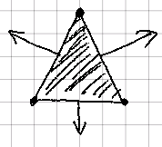
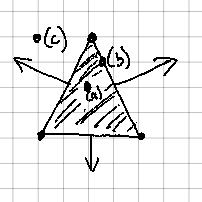
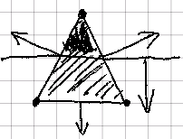
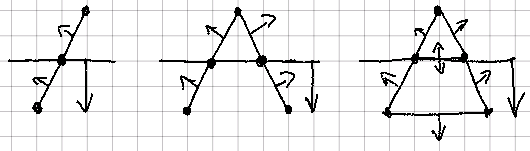
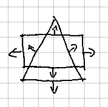
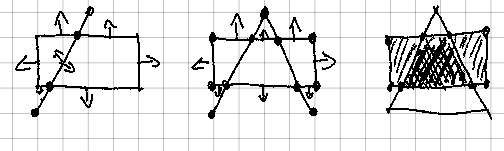

## Polygons: Edge Cycles

Before, we saw how edges are simple but powerful building blocks. Now, we'll
use them to actually build things.

We can use an intersection of an arbitrary number of halfspaces to build
a _convex polygon_ which we will hence refer to simply as a _polygon_.

|  |
|:--:|
| _A triangle is a polygon_ |

We can now immediately see why it is useful to store the points of the
associated edges: it lets us track the intersection points of the halfspaces.

We define each polygon to have three key properties:

- **non-zero**: it has three or more edges.
- **closed**: every point in the polygon belongs to exactly two line segments.
- **convex**: every point and edge in the polygon is _inside_ or _on_ the
  associated halfspace for every other edge.

### Polygons Contain Points

Because polygons are collections of halfspaces, and because halfspaces
are containers of points, the container relationship of polygons to points is
easy to derive:

|  |
|:--:|
| _(a) in,  (b) on, and (c) out points for our triangle_ |

- If the point is _on_ any of the halfspaces, it is _on_ the polygon.
- If the point is _in_ all of the halfspaces, it is _in_ the polygon.
- Otherwise, the point is _out_ of the polygon.

### Edges Cut Polygons

The cutting capability of edges can also be trivially upgraded to cut
polygons as well. Edges have halfspaces, halfspaces can cut edges, and
polygons are collections of edges. We can combine these three properties to
see that an edge can cut a polygon.

The method is straightforward. Start with the intact `target` polygon. Use
the `knife` edge to divide each edge in the polygon into an _in_ edge, an
_out_ edge, and any point _on_ both edges.

|  |
|:--:|
| _Cutting our target triangle with an edge knife_ |

The intermediate result will be a list of _out_ edges, a list of _in_
edges, and two or fewer points _on_ the polygon.

If exactly two points are _on_ the polygon, two new opposing edges must be
added to close the resultant hole. This is necessary to preserve the
**closed** law. For the _in_ polygon, the edge has the same normal as the
`knife` edge. For the _out_ polygon, the normal is reversed.

|  |
|:--:|
| _Forming the two new polygons resulting from the cut_ |

The end result is zero or one _in_ polygons, a point or edge _on_ our
`knife`, and zero or one _out_ polygons. Any polygon with fewer than three
edges is discarded per our **non-zero** definition.

Note that the abstract algorithm here where a knife cuts a set of targets is
one that will also be useful later when we consider more complex objects and
additional dimensions.

### Polygons Cut Polygons

Because polygons are collections of halfspaces, and because other polygons
are collections of edges, we can use a polygon to cut another polygon!

|  |
|:--:|
| _A triangle knife and a target box_ |

The algorithm is iterative. We start with the `target` polygon. For each edge
of the `knife` polygon, we cut the `target`. We record any _out_ polygons
and _on_ points and edges. We use the remaining _in_ polygon, if any,
as the `target` for the next edge, until no edges are left in the `knife`.

|  |
|:--:|
| _Using our triangle knife to cut a target box_ |

The end result is a set of _in_ polygons, a set of _on_ points, a set of _on_
edges, and a set of _out_ polygons. Generally speaking, by this point the
_in_ and _out_ polygons are all we care about. We thus usually discard the
_on_ points and edges.

We will note again that this iterative algorithm that uses a set of knives to
cut a target object will also be useful in the future.

### Sets of Polygons

We see this "set of polygons" result twice here. We will call this new
concept a _shape_, and discuss next how it is a powerful tool for modeling
two-dimensional objects.