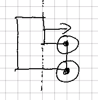
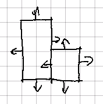
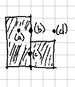
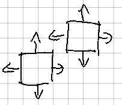
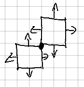
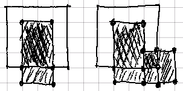
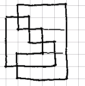
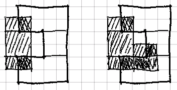
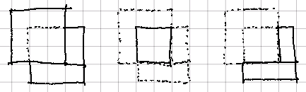
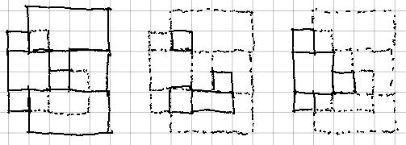

## Shapes: Sets of Polygons

There are clearly some two-dimensional objects that cannot be modeled
with individual convex polygons. Any concave polygon is an example:

|  |
|:--:|
| _The two points circled are outside the halfspace of one edge_ |

This is where the prior concept we called a _shape_ comes into play. A shape
is simply a set of polygons. Unlike the polygon, we can use this concept to
model arbitrary two-dimensional objects, including concave polygons:

|  |
|:--:|
| _We can model this object as a set of two simpler polygons_ |

For the math-inclined among us, the set-theoretic way to describe this object
is a _union_ of _intersections_ of halfspaces.

Like with polygons, we'll set some ground rules:

- **non-zero**: a shape must have at least one polygon.
- **distinct polygons**: every polygon in a shape must be completely
  _outside_ of every other polygon in the shape.

### Shapes Contain Points

Shapes are unions of polygons. Polygons contain points. Shapes can therefore
also contain points:

- If a given point is _in_ any polygon, it is _in_ the shape.
- If a given point is _on_ a single polygon, it is _on_ the shape.
- If a given point is _on_ two polygons, it is ambiguous whether it is _in_ the
  shape or _on_ it.
- Otherwise, the point is _out_ of the shape.

The third point is important to keep in mind, as we will see it again when we
add another dimension. One formal way to describe this conundrum is that
internal edges of shapes (those _on_ exactly two member polygons) are
non-orientable.

|  |
|:--:|
| _A shape and points that are (a) in / (b) on / (c) in-on / (d) out_ |

In practice, we usually choose a default judgment (in our case, _in_) for such
edge cases.

### Shapes Can Have Multiple Parts

Note that nothing in our definition precludes a shape with multiple totally
disconnected parts:

|  |
|:--:|
| _A shape with two disjoint parts_ |

Also note that the non-orientable property described above makes it difficult
in some cases to determine connectivity:

|  |
|:--:|
| _Two squares that touch at one point_ |

This means that any operation that works on connected polygons (e.g. an
operation that traces its outer boundary) must make a judgement on whether to
permit edge-connections or point-connections.

### Edges and Polygons Cut Shapes

We've already explored how each of these objects can cut the constituent
polygons that make up a shape. The corresponding operation on sets of
polygons is obvious: for each polygon, cut using the given `knife`.
Accumulate the _inside_ and _outside_ parts into new respective shapes.

|  |
|:--:|
| _Using a square polygon to cut a L shape_ |

### Shapes Cut Shapes

This is a bit trickier, but is still relatively easy to reason through.

|  |
|:--:|
| _A U-shape and a L-shape_ |

We start with a `current` shape that is equivalent to the `target`, and an
`inner` shape that starts empty. We then iterate over each polygon in the
`knife`. We use each polygon to cut the remaining `target` shape. The _in_
polygons are added to the `inner` shape. The _out_ polygons are retained and
become the new `target` for the next polygon in the `knife`.

|  |
|:--:|
| _Using a U-shape to cut a L-shape_ |

We know that the `inner` polygons cannot be cut again because of the
**distinct polygons** property set out above.

### Math with Shapes

A perceptive reader may have noted by this point that we now have everything
we need to do our core CSG operations with two-dimensional objects:

- To find the _union_ of two shapes, we use one shape to cut another. The
  _in_ shape is discarded (to preserve the **distinct polygons** property),
  and the _out_ shape is combined with the `knife` to form the union.
- To find the _intersect_ of two shapes, we again use one shape to cut another.
  The _in_ shape is the result, and the _out_ shape is discarded.
- To find the _difference_ of two shapes, we use the negative shape to cut the
  positive shape, and use only the resulting _out_ shape.

Let's see what this looks like with polygons:

|  |
|:--:|
| _CSG operations with polygons_ |

And shapes:

|  |
|:--:|
| _CSG operations with shapes_ |

Note that in all cases, we preserve our key **distinct polygons** rule from
above. Also consider that there are cases where our **non-zero** rule will
force us to concede that _no_ shape results from a given operation (e.g.
when calculating the intersect of two totally disjoint shapes).

### The Next Dimension

And just like that, we're done with CSG in two dimensions. This
lower-dimensional dicussion has given us a solid theoretical foundation that
we can build upon. And, as we will see in the next section, every concept we
have covered so far has a straightforward extension into the third dimension.